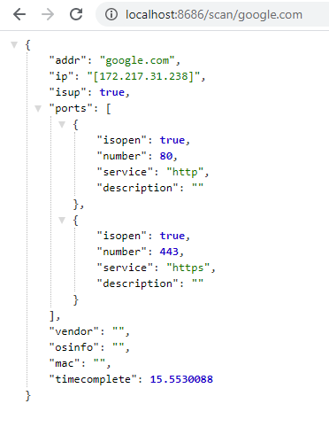

# glance

[](https://opensource.org/licenses/MIT)
[](https://goreportcard.com/report/github.com/viiftw/glance)

A tiny port scanner run as a service written in Go

## Usage

Clone this repo and go to that folder:

```bash
go run main.go
```

Currently supports TCP scan only  
Default service run on port 8686, to scan port of ip/hostname (example: google.com) browse to

[http://localhost:8686/scan/google.com](http://localhost:8686/scan/google.com)

Get result



## License

This repo is available as open source under the terms of the [MIT License](https://opensource.org/licenses/MIT).  
You are welcome to contribute!
